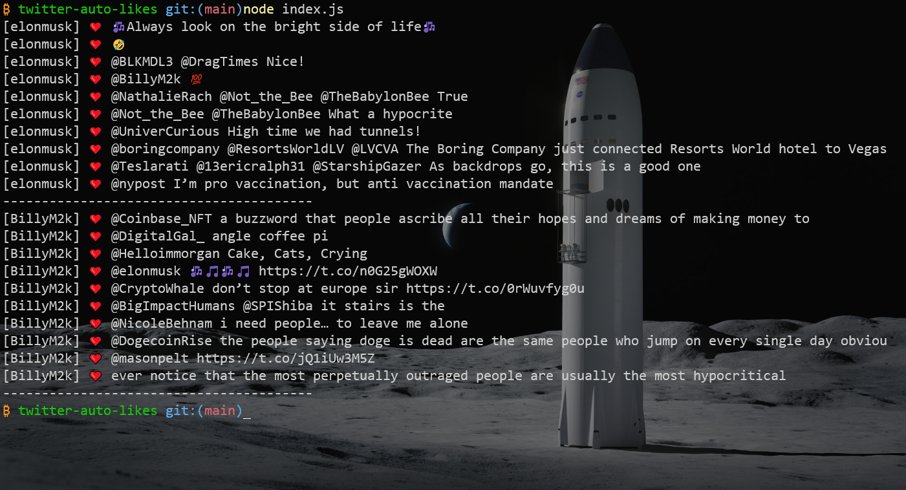

# twitter-auto-likes




## Clone repo
```
$ git clone https://github.com/lee1221ee/twitter-auto-likes.git
$ cd twitter-auto-likes
```

## Edit configuration
+ In order enter four key. (Don't push to your github or any web)
+ `user_id`: Your Twitter ID. (Not username)
+ `users`: List of liked users (No more than 5 users recommended)
```
const config = {
  consumer_key: process.env.consumer_key || "ENTER YOUR KEY HERE",
  consumer_secret: process.env.consumer_secret || "ENTER YOUR KEY HERE",
  access_token_key: process.env.access_token_key || "ENTER YOUR KEY HERE",
  access_token_secret: process.env.access_token_secret || "ENTER YOUR KEY HERE",
  user_id: "1446550953679724545",
  users: ["elonmusk", "mikecryptolife", "yescooler7985"]
}
```

## Local test
```
$ node index.js
```

## Deploy repo to Heroku
Notice: Change `twitter-auto-likes` to your APP's name
```
heroku login
heroku git:remote -a [twitter-auto-likes]
git push heroku master
```

## Set Heroku Config Vars
```
heroku config:set consumer_key="ENTER YOUR KEY HERE"
heroku config:set consumer_secret="ENTER YOUR KEY HERE"
heroku config:set access_token_key="ENTER YOUR KEY HERE"
heroku config:set access_token_secret="ENTER YOUR KEY HERE"
```
